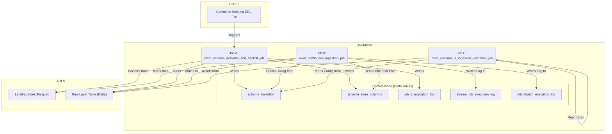

```mermaid
graph TD
    subgraph GitHub
        A["Commit to Schema DDL File"]
    end

    subgraph Databricks
        subgraph "Control Plane (Delta Tables)"
            CP1["schema_transition"]
            CP2["schema_store_columns"]
            CP3["job_a_execution_log"]
            CP4["stream_job_execution_log"]
            CP5["microbatch_execution_log"]
        end

        B("Job A: ewm_schema_activator_and_backfill_job")
        C("Job B: ewm_continuous_ingestion_job")
        D("Job C: ewm_continuous_ingestion_validation_job")
    end
    
    subgraph ADLS
        E["Landing Zone (Parquet)"]
        F["Raw Layer Table (Delta)"]
    end

    A -->|Triggers| B
    B -->|Writes| CP1
    B -->|Writes| CP2
    B -->|Writes| CP3
    B -->|Alters| F
    B -->|Backfills from| E
    
    C -->|Reads Config from| CP1
    C -->|Reads Blueprint from| CP2
    C -->|Reads from| E
    C -->|Writes to| F
    C -->|Writes Log to| CP4
    C -->|Writes Log to| CP5

    D -->|Reads from| F
    D -->|Reads Config from| CP1
    D -->|Reports on| D
```